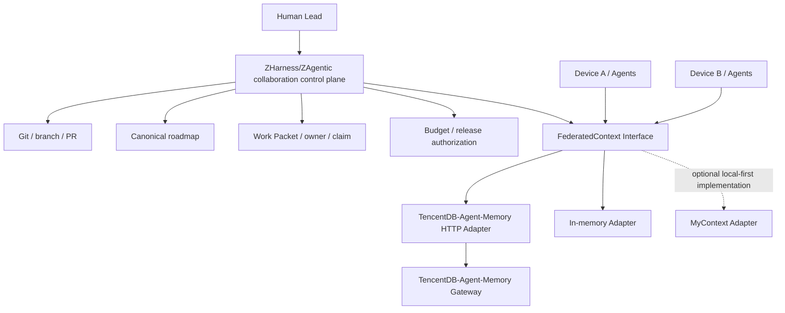

# Federated Context PRD

English | [中文](federated-context.zh.md)

## Decision

The shared context layer for Human-led federation uses TencentDB-Agent-Memory through two complementary strategies: deploy the upstream project unchanged as an independent runtime, and define a ZHarness-owned `FederatedContext` Interface with an HTTP Adapter. Do not fork the upstream project or copy its internals yet; retain MyContext as a candidate Adapter for device-private context.

This choice addresses only shared memory and metadata across devices and Agents. ZHarness/ZAgentic's collaboration control plane continues to own Git, branches, PRs, the canonical roadmap, Work Packets, owners, claims, experiment budgets, and release authorization.

## Selection basis

The research is pinned to these revisions:

- TencentDB-Agent-Memory: `97f94654280b2932c35ba4806a491999ed244cc9`
- MyContext: `81b3c7ac178dbf141ca97cbe6b6682f73e3d3199`

TencentDB-Agent-Memory already provides an independent HTTP Gateway, TypeScript and Python SDKs, multi-layer memory, knowledge and asset metadata, and models for users, teams, Agents, tasks, Skills, memberships, ownership, visibility, and ACLs. Its authorization implementation checks owners, team membership, visibility, role defaults, and explicit ACLs, which makes it suitable as a centrally deployed shared memory and metadata Module.

MyContext excels at personal work-data ingestion, a local SQLite vault, knowledge graphs, persistent retrieval, incremental synchronization, and recoverable ingestion. Its current product focus and data deployment model fit a single device or private personal context better than the first production implementation of shared team facts.

## Module responsibilities



`FederatedContext` is a ZHarness-owned Seam. The production Adapter translates TencentDB-Agent-Memory authentication, identifiers, requests, responses, and errors; the in-memory Adapter supports deterministic tests. Together, the two Adapters give the Seam genuine substitutability in production and tests.

## Draft FederatedContext Interface

The first Interface exposes only four categories of behavior:

```ts
interface FederatedContext {
  remember(input: ContextWrite): Promise<ContextWriteResult>;
  retrieve(input: ContextQuery): Promise<ContextResult>;
  resolveOwnership(input: OwnershipQuery): Promise<OwnershipResult>;
  health(): Promise<ContextHealth>;
}
```

The core data must express:

- `ContextRecord`: opaque id, logical key, scope, content, revision, provenance, owner, and access-policy reference.
- `ContextWrite`: record content, source, owner, access policy, idempotency key, and optional expected revision.
- `ContextQuery`: requester identity, allowed scopes, retrieval criteria, provenance requirements, and limit.
- `ContextResult`: records, query identifier, and freshness.
- `ContextWriteResult`: record id, revision, idempotency-hit status, and conflict status.

The Interface exposes neither TencentDB-Agent-Memory's L0/L1/L2/L3 levels, concrete databases, OpenClaw/Hermes types, or migration scripts, nor MyContext's SQLite and knowledge-graph internals. This Depth gives callers uniform permission, provenance, version, and error semantics while concentrating third-party changes inside the Adapter, preserving caller Leverage and implementation Locality.

## Adoption strategy

| Strategy | Decision | Scope |
|---|---|---|
| Reuse the project directly | Adopt | Independently deploy TencentDB-Agent-Memory Gateway, memory pipeline, storage, and observability implementation |
| Modify the project | Defer | Review a fork only after the PoC proves that an Adapter cannot bridge a required gap |
| Extract useful parts | Adopt | Absorb the domain model and client-integration approach without copying internals |
| Continue research | Bounded adoption | Compare at most 2–3 additional candidates that meet strict screening criteria without blocking the PoC |

## Unknowns the PoC must validate

TencentDB-Agent-Memory exposes increasing versions and historical reads, but its existing write requests do not explicitly demonstrate expected revisions, `If-Match`, or equivalent compare-and-swap semantics. Whether a version number prevents concurrent overwrites remains a critical unknown; returning a version does not by itself establish conflict protection.

The PoC must also verify:

- Human, device, and Agent identities map stably to Gateway identities.
- Every read and write path consistently enforces team, owner, visibility, and ACL checks.
- `Work Packet`, source commit, path, receipt, and content fingerprint can be stored as searchable provenance.
- Retries accept a caller-provided idempotency identifier and network recovery does not create duplicate records.
- Concurrent writes reject stale revisions and return auditable, recoverable conflicts.
- Gateway traces correlate device, Agent run, Work Packet, and request id.
- Storage migration, backup, and recovery satisfy the operating requirements of a centralized shared service.

## Fork triggers

Review a fork only when a required gap cannot be bridged by an Adapter:

1. ACLs cover only some paths and the upstream project has no usable extension point.
2. The Gateway cannot express a required scope, provenance field, or identity mapping.
3. Revision conflict detection or idempotent writes cannot be implemented.
4. Network recovery can silently lose or overwrite data.
5. Configuration and external wrapping cannot satisfy the target deployment's performance, isolation, or audit requirements.

Every fork proposal must link a reproducible PoC failure and explain why an independent Adapter, upstream contribution, or control-plane compensation cannot resolve it.

## Future role of MyContext

MyContext is not a competing replacement for TencentDB-Agent-Memory. It is a potential second production Adapter: MyContext ingests and retrieves private personal context on a device, and only facts selected by explicit policy and carrying an owner and provenance enter the shared team layer. TencentDB-Agent-Memory continues to store shared facts, while the ZHarness/ZAgentic control plane decides whether to publish them.

## Phased implementation

### Phase 0: two-device PoC

Deploy one pinned Gateway version and have two devices, each using a distinct Agent identity, exercise writes, authorized retrieval, denied access, duplicate requests, concurrent updates, and offline recovery. The PoC does not alter the main ZHarness flow; it produces acceptance evidence and a gap list.

### Phase 1: establish the real Seam

Define a `FederatedContext` Service Definition and Consumer in ZHarness, with TencentDB-Agent-Memory HTTP and in-memory Providers. Tests verify behavior only through the Interface and do not depend on upstream database structures.

### Phase 2: integrate the collaboration control plane

Write Work Packet creation, Agent claims, stage completion, Human decisions, and release events into retrievable context. At startup, an Agent retrieves context by requester, scope, and provenance requirements. Memory stores a retrievable projection; Git, roadmaps, and receipts remain the canonical sources for their respective facts.

### Phase 3: small-scale pilot

Use 2–3 devices, 5–10 Agents, and 10–20 Work Packets to validate stability, permissions, and collaboration value before deciding whether to introduce a MyContext Adapter, contribute upstream, or fork.

## Initial health metrics

| Metric | Definition | Target |
|---|---|---:|
| `context_provenance_rate` | Percentage of context adopted by Agents that traces to a source, revision, or receipt | ≥ 98% |
| `ownership_resolution_rate` | Percentage of shared context with a resolvable owner and access policy | 100% |
| `control_plane_bypass_rate` | Percentage of collaboration facts entering the shared layer without an associated Work Packet, roadmap, or authorization | 0% |
| `cross_device_freshness_lag` | p95 time from a canonical-source update until another device can retrieve it | ≤ 60 seconds |
| `memory_write_conflict_rate` | Percentage of concurrent writes that trigger conflict or Human adjudication | < 1%; every conflict recoverable and auditable |
| `unauthorized_allow_count` | Number of requests that should be denied but are allowed | 0 |
| `retry_duplicate_rate` | Percentage of retries that create duplicate logical records | 0% |

## Additional-research stopping condition

An additional candidate must provide a remote sharing interface, team and Agent identity, ACL enforcement, provenance, revision and conflict handling, idempotent writes, and a deployable runtime. Compare at most 2–3 candidates; if none creates a clear Pareto improvement in required capabilities and maintenance cost, stop searching and execute Phase 0.
