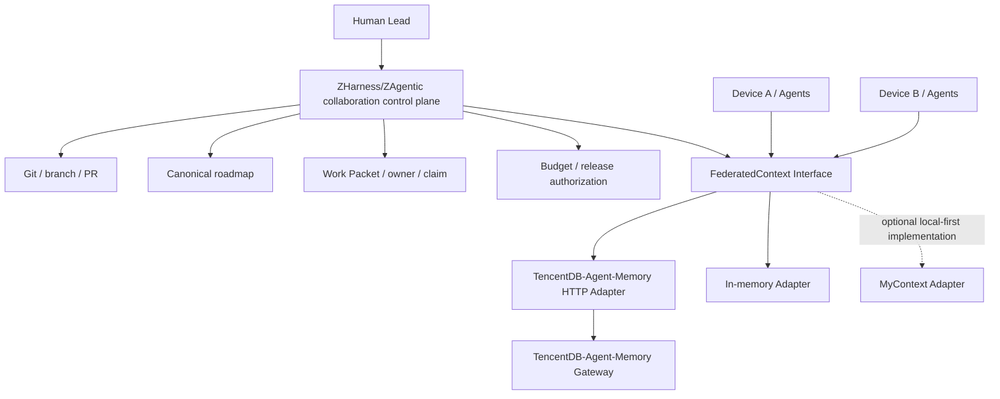

# Federated Context PRD

[English](federated-context.md) | 中文

## 结论

Human-led federation 的共享上下文层采用 TencentDB-Agent-Memory，组合使用两种策略：将上游项目作为独立运行时直接复用，在 ZHarness 内定义自有 `FederatedContext` Interface 并实现 HTTP Adapter。当前不 fork 上游，也不复制其内部实现；MyContext 保留为设备私有上下文的候选 Adapter。

这项选择只解决跨设备、跨 Agent 的共享 memory 和 metadata。Git、branch、PR、canonical roadmap、Work Packet、owner、claim、实验预算和发布授权仍由 ZHarness/ZAgentic collaboration control plane 管理。

## 选择依据

调研固定在以下版本：

- TencentDB-Agent-Memory：`97f94654280b2932c35ba4806a491999ed244cc9`
- MyContext：`81b3c7ac178dbf141ca97cbe6b6682f73e3d3199`

TencentDB-Agent-Memory 已提供独立 HTTP Gateway、TypeScript/Python SDK、多层 memory、knowledge/asset metadata，以及 users、teams、Agents、tasks、Skills、memberships、ownership、visibility 和 ACL 模型。权限实现会检查 owner、team membership、visibility、role default 和显式 ACL，适合作为集中部署的共享 memory/metadata Module。

MyContext 的优势是个人工作数据摄取、本地 SQLite vault、知识图谱、持久检索、增量同步和可恢复 ingestion。其当前产品定位和数据部署方式更适合单设备或个人私有上下文，不适合作为团队共享事实的第一生产实现。

## Module 分工



`FederatedContext` 是 ZHarness 拥有的 Seam。生产 Adapter 转换 TencentDB-Agent-Memory 的认证、标识、请求、响应和错误；In-memory Adapter 支持确定性测试。两个 Adapter 使该 Seam 对生产和测试都具有真实替换价值。

## FederatedContext Interface 草案

第一版 Interface 只暴露四类行为：

```ts
interface FederatedContext {
  remember(input: ContextWrite): Promise<ContextWriteResult>;
  retrieve(input: ContextQuery): Promise<ContextResult>;
  resolveOwnership(input: OwnershipQuery): Promise<OwnershipResult>;
  health(): Promise<ContextHealth>;
}
```

核心数据需要表达：

- `ContextRecord`：opaque id、logical key、scope、content、revision、provenance、owner 和 access policy reference。
- `ContextWrite`：record 内容、来源、owner、访问策略、idempotency key，以及可选 expected revision。
- `ContextQuery`：requester identity、允许查询的 scopes、检索条件、provenance 要求和 limit。
- `ContextResult`：records、查询标识和 freshness。
- `ContextWriteResult`：record id、revision、幂等命中状态和 conflict 状态。

Interface 不暴露 TencentDB-Agent-Memory 的 L0/L1/L2/L3、具体数据库、OpenClaw/Hermes 类型或迁移脚本，也不暴露 MyContext 的 SQLite 和知识图谱内部类型。这种 Depth 为调用方提供统一的权限、来源、版本和错误语义，并把第三方变化集中在 Adapter 内，保持调用方的 Leverage 和实现维护的 Locality。

## 采用策略

| 策略 | 决策 | 适用范围 |
|---|---|---|
| 直接复用项目 | 采用 | 独立部署 TencentDB-Agent-Memory Gateway、memory pipeline、存储和可观测实现 |
| 基于项目修改 | 暂不采用 | PoC 证明 Adapter 无法弥补必要缺口后再评审 fork |
| 抽取有用部分 | 采用 | 吸收领域模型和客户端集成方式，不复制内部实现 |
| 继续调研 | 有界采用 | 最多补充比较 2–3 个严格满足筛选条件的候选，不阻塞 PoC |

## PoC 必须验证的未知项

TencentDB-Agent-Memory 暴露递增版本和历史读取，但现有写入请求没有显式证明 expected revision、If-Match 或等价 compare-and-swap 语义。版本号是否能阻止并发覆盖仍是关键未知项，不能把“返回 version”视为已经解决冲突。

PoC 还需验证：

- Human、device 和 Agent 身份能否稳定映射到 Gateway 身份。
- 所有读取和写入路径是否一致执行 team、owner、visibility 和 ACL 检查。
- `Work Packet`、source commit、path、receipt 和 content fingerprint 能否作为可检索 provenance 保存。
- 重试是否支持调用方提供的幂等标识，网络恢复是否产生重复记录。
- 并发写入能否拒绝过期 revision，并返回可审计、可恢复的 conflict。
- Gateway trace 能否关联 device、agent run、Work Packet 和 request id。
- 存储迁移、备份和恢复是否满足集中共享服务的运行要求。

## Fork 触发条件

只有出现 Adapter 无法弥补的必要缺口时才评审 fork：

1. ACL 只覆盖部分路径，且上游没有可用扩展点。
2. required scope、provenance 或身份映射无法通过 Gateway 表达。
3. 无法实现 revision conflict detection 或幂等写入。
4. 网络恢复会静默丢失或覆盖数据。
5. 目标部署的性能、隔离或审计要求无法通过配置和外部封装满足。

任何 fork 提案必须关联一个可复现的 PoC 失败，并说明为什么独立 Adapter、上游贡献或 control-plane 补偿都不能解决。

## MyContext 的后续位置

MyContext 不作为 TencentDB-Agent-Memory 的竞争性替换，而作为潜在的第二生产 Adapter：设备上的个人私有上下文先由 MyContext 摄取和检索，只有经过明确策略筛选、带 owner 和 provenance 的事实才进入团队共享层。共享事实仍由 TencentDB-Agent-Memory 保存，是否发布由 ZHarness/ZAgentic control plane 决定。

## 分阶段实施

### Phase 0：两设备 PoC

部署一份固定版本的 Gateway，让两台设备分别以独立 Agent 身份完成写入、权限检索、拒绝访问、重复请求、并发更新和断网恢复。PoC 不改 ZHarness 主流程，只产出验收记录和缺口清单。

### Phase 1：建立真实 Seam

在 ZHarness 中定义 `FederatedContext` Service Definition/Consumer，提供 TencentDB-Agent-Memory HTTP Provider 和 In-memory Provider。测试只通过 Interface 验证行为，不依赖上游数据库结构。

### Phase 2：接入 collaboration control plane

Work Packet 创建、Agent claim、阶段完成、Human decision 和 release 事件写入可检索上下文；Agent 启动时按 requester、scope 和 provenance 要求检索。Memory 保存可检索投影，Git、roadmap 和 receipt 继续作为对应事实的 canonical source。

### Phase 3：小规模 pilot

使用 2–3 台设备、5–10 个 Agent、10–20 个 Work Packet 验证稳定性、权限和协作收益，再决定是否引入 MyContext Adapter、贡献上游或 fork。

## 首批健康指标

| 指标 | 口径 | 目标 |
|---|---|---:|
| `context_provenance_rate` | Agent 采用的 context 中可追溯到 source、revision 或 receipt 的比例 | ≥ 98% |
| `ownership_resolution_rate` | shared context 能解析 owner 和 access policy 的比例 | 100% |
| `control_plane_bypass_rate` | 未关联 Work Packet、roadmap 或授权而进入共享层的协作事实比例 | 0% |
| `cross_device_freshness_lag` | canonical source 更新到另一设备可检索的时间差 p95 | ≤ 60 秒 |
| `memory_write_conflict_rate` | 并发写入触发冲突或人工裁决的比例 | < 1%，全部可恢复并可审计 |
| `unauthorized_allow_count` | 应拒绝请求被允许的次数 | 0 |
| `retry_duplicate_rate` | 重试产生重复 logical record 的比例 | 0% |

## 补充调研停止条件

补充候选必须同时提供远程共享接口、team/agent identity、ACL enforcement、provenance、revision/conflict、幂等写入和可部署运行时。最多比较 2–3 个候选；如果没有候选在必要能力和维护成本上形成明确 Pareto 优势，停止搜索并执行 Phase 0。
