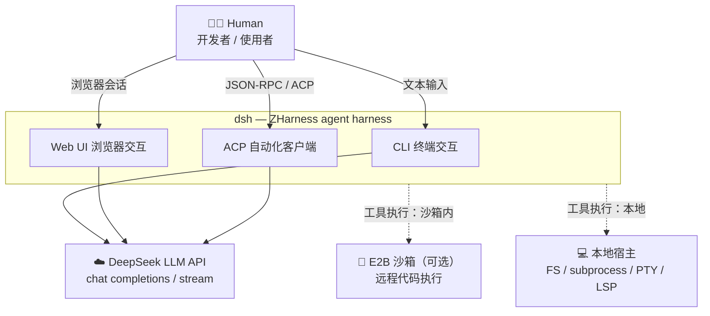
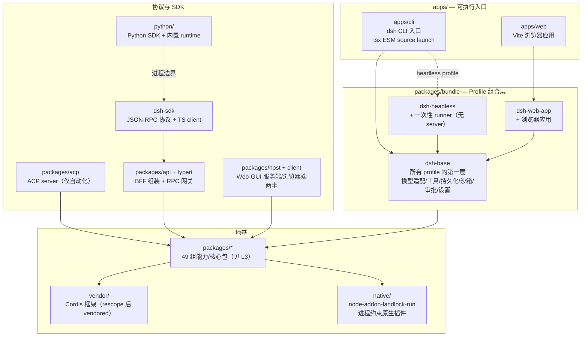
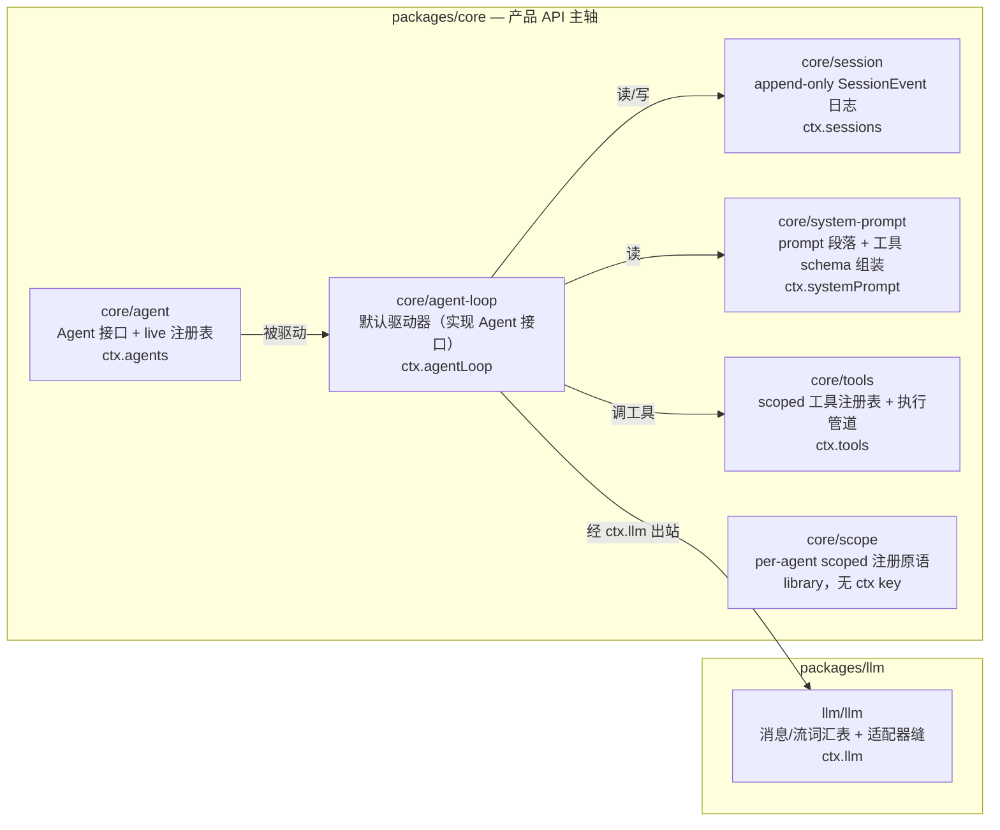
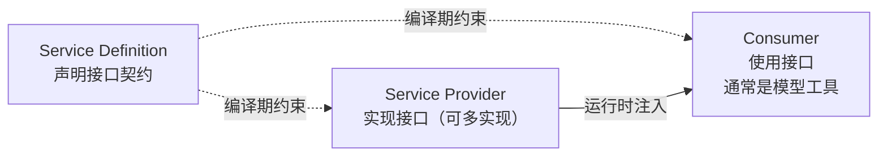
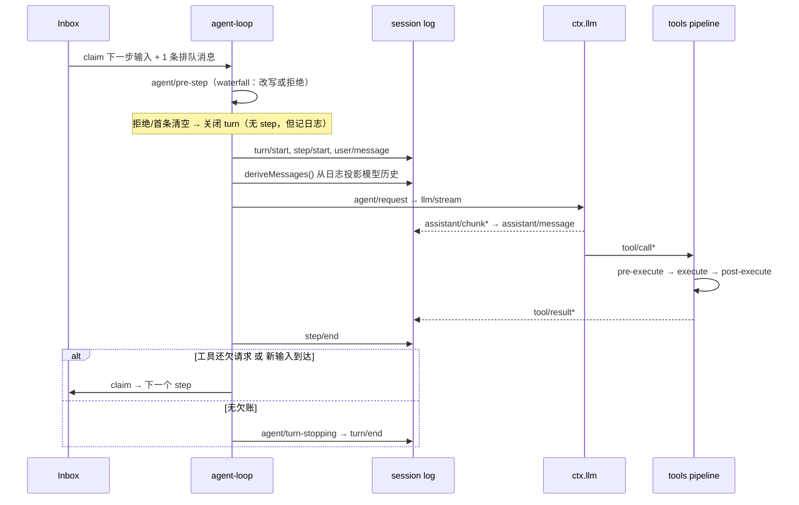
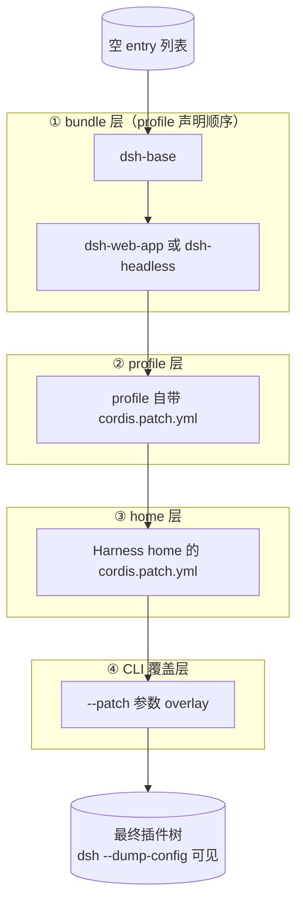
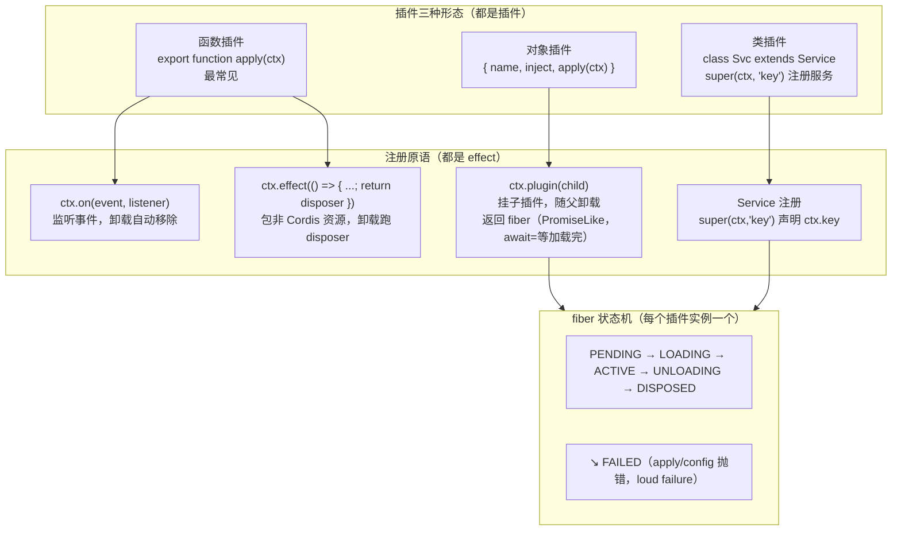
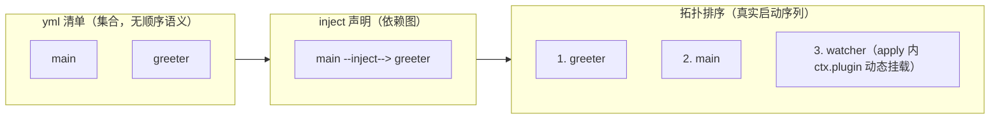
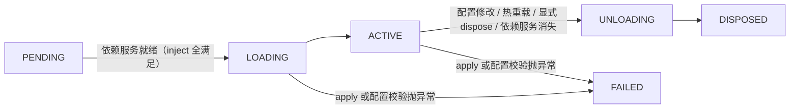

# ZHarness 架构全景（C4 视角）

> **数据源文件**：本 md 是唯一数据源，HTML 由 `gen_panorama_html.py` 从本文件生成，禁止手改 HTML。
> **同步策略**：随学习路线图（`learning_roadmap.json`）进度逐层展开。每节标注解锁节点与状态。
> 最后更新：2026-08-15（解锁至 1-3）

## 进度索引

| C4 层 | 章节 | 解锁节点 | 状态 |
|---|---|---|---|
| L1 | [系统上下文](#l1-系统上下文) | 1-2-1 | ✅ 已展开 |
| L2 | [容器](#l2-容器) | 1-2-2 | ✅ 已展开（实测校准） |
| L3 | [组件：核心包](#l3-组件核心包) | 1-2-1 | ✅ 已展开 |
| L3 | [组件：能力缝 seam](#l3-组件能力缝-seam) | 1-4-2 | 🔒 待展开（已有骨架） |
| L3 | [组件：Turn/Step 事件流](#l3-组件turnstep-事件流) | 1-2-1 | ✅ 已展开 |
| L3 | [组件：Profile/Bundle 组合](#l3-组件profilebundle-组合) | 1-2-1 | ✅ 已展开 |
| L3 | [组件：插件形态与注册原语](#l3-组件插件形态与注册原语) | 1-2-3 | ✅ 已展开（demo 实证） |
| L3 | [组件：插件运行时机制](#l3-组件插件运行时机制) | 1-3 | ✅ 已展开（7 课 + 3 demo 实证） |
| L4 | [代码：关键接口](#l4-代码关键接口) | 1-4 | 🔒 待展开 |

---

## L1 系统上下文

ZHarness（`dsh`）是一个插件式 agent harness：一切皆插件，包括模型适配器、工具注册表、会话日志和 agent loop 本身。



**关键事实**（来源：architecture.md）：

- 无特权核心：扩展方式是「在别的插件旁边挂一个插件」，注册即 effect，卸载即回收
- Session log 是唯一真相：*Model-visible means logged*，模型请求内容必须可从日志重建（运行时断言强制）
- 换一个 provider = 换整个执行世界（fs/subprocess 共享一个执行世界，指向远程沙箱时 Bash/PTY/LSP 整体跟随）

---

## L2 容器

仓库物理结构 → 运行时容器。`packages/` 下 49 组均为 `@deepseek-ai/dsh-*` workspace 包（实测校准，README 表 47 行缺 `mcp/`、`runtime-diagnostics/` 登记）。



**关键事实**（校准来源：packages/README.md、docs/development.md、AGENTS.md + 实测 `ls`）：

- Profile = 命名组合（存于 Harness home），列出 bundle 顺序 + 自带 `cordis.patch.yml`
- 层叠顺序：profile 列出的 bundle（按序）→ profile `cordis.patch.yml` → home 级 patch → `--patch` 覆盖层
- 查看实际启动树：`dsh --profile web --dump-config`，任何一行都可被上层 patch 替换
- `@deepseek-ai/cordis` 是所有 harness 包的 peerDependency；ESM only；`!!js`（非 `!js`）只允许出现在 plugin `config` 与 entry `disabled` 字段

### 仓库布局速查（实测校准，2026-08-15）

> AGENTS.md 布局段已过时：缺 `apps/`、`assets/`、`patches/`；packages 表缺 `mcp/`、`runtime-diagnostics/` 登记。下表以实测为准。

| 顶层目录 | 角色 |
|---|---|
| `apps/` | 可执行入口：`cli`（dsh CLI）、`web`（Vite 浏览器应用） |
| `packages/` | 49 组 `@deepseek-ai/dsh-*` workspace，位于 `packages/<group>/<pkg>/` |
| `vendor/` | Vendored Cordis 源码（rescope 后），manifest + sync 流程在 `vendor/README.md` |
| `python/` | Python SDK + 内置 runtime |
| `native/` | `@deepseek-ai/node-addon-landlock-run` 进程约束原生插件（source of record） |
| `examples/` | 可运行 `cordis.yml` leaves，叠加 `packages/examples` bundles |
| `.agents/` | Agent workflows + Agent Notes（`notes/`） |
| `docs/` | 架构、生成目录、复盘、cookbook |
| `scripts/` | 仓库 gates 与 generators |
| `website/` | VitePress 投影（选定的双语 docs 源） |
| `assets/` | 静态资源 |
| `patches/` | pnpm patch 记录 |

**packages/ 分组**（49 组，按角色归类）：

| 归类 | 组 |
|---|---|
| 产品 API 主轴 | `core/`（session/system-prompt/tools/agent/agent-loop/scope） |
| LLM 与执行能力 | `llm/` `e2b/` `subprocess/` `shell/` `terminal/` `code-runtime/` `sandbox/` `fs/` `lsp/` `skill/` `web/` `compaction/` `context/` `subagent/` `jobs/` `workflow/` `todo/` `plan/` `preset/` `guard/` |
| 会话与持久化 | `session/` `session-query/` `storage/` `workspace/` `identity/` `attachment/` `spill/` `settings/` `credentials/` `goal/` `schedule/` `feedback/` |
| 组合与自修改 | `bundle/` `extensions/` `hooks/` |
| 协议与 GUI | `sdk/` `acp/` `api/` `typert/` `host/` `client/` `boot/` `interaction/` `mcp/` |
| 支撑 | `examples/` `test-support/` `util/` `runtime-diagnostics/` |

**TypeScript 双聚合构建**（Host/Client 分开的根因是 declaration merging 冲突）：

| 聚合 | 覆盖 | 产物 |
|---|---|---|
| `tsconfig.host.json` | Host 包、examples、tests、scripts、website、`api/remotes` 的 Host 面 | Host lib + Typert 反射产物 |
| `tsconfig.client.json` | `packages/client/*`、`apps/web`、`api/remotes` 的 Client 面 | 浏览器 bundle |

- 两边在同一 Cordis `Context` 接口下 merge 不同的 service；一个 `ts.Program` 同时看到两边会报冲突，故必须分程序
- 构建顺序：`tsc -b host` → `tsdown host`（Typert 只在 Host phase 跑）→ `tsc -b client` → `tsdown client` → `build:web`
- lefthook：pre-commit（配对记录+oxlint+白空格+vendor manifest）、pre-merge-commit（配对检查）、pre-push（`pnpm run typecheck`）
- 环境：Node ^22.19 || >=24，pnpm 11.7.0 pin，ESM only（`"type": "module"`）

---

## L3 组件：核心包

产品 API 主轴（`ctx` key 来自 architecture.md 核心包表）：



**三个事件域**（选对域是大多数改动的第一个决策）：

| 域 | 用途 | 例子 |
|---|---|---|
| Session 事件 | 事实必须**熬过重载**（durable） | `session/event` 广播 `user/message`、`tool/result` |
| Agent 事件 (`agent/*`) | 观察/拦截**在途**工作 | inbox、step、status、request、validation |
| Capability 事件 | 给缝挂策略/适配器，**不 import loop** | `fs/*`、`tools/*`、`telemetry/*` |

---

## L3 组件：能力缝 seam

> 🔒 按 1-4-2 精读能力包后展开细节。当前为骨架。

一个 seam = 三个角色，缺一不算：



已知 seam 一览（`ctx` key → 典型 provider / consumer）：

| seam key | provider 变体 | 消费者 |
|---|---|---|
| `ctx.llm` | DeepSeek 适配器 | agent-loop |
| `ctx.fs` | 本地 / 沙箱 FS | fs 工具、LSP |
| `ctx.subprocess` | 本地进程树 | shell、terminal |
| `ctx.shell` | 本地 / pwsh | Bash 工具 |
| `ctx.terminals` | 持久会话 | dsh-tool-terminal |
| `ctx.sandbox` | Landlock / E2B | 消费者在 spawn 前 wrap argv |
| `ctx.agents`（subagent） | 子 agent / 委派 turn | subagent 工具 |
| `ctx.commands` | 人发命令（无模型 turn） | CLI 命令分发 |
| `ctx.jobs` | 后台工作 | `job_*` 工具 |

---

## L3 组件：Turn/Step 事件流

step = 一次模型请求 + 它调用的工具；turn = 零或多个 step。输入只走一条 inbox。



**waterfall vs serial**：`agent/pre-step`、`agent/request`、`llm/stream`、三个 `tools/*` 是 waterfall（listener 必须调 `next()` 下放）；`agent/turn-stopping` 是 serial 且无 `next()`。durable 事件：`turn/*`、`step/*`、`user/message`、`assistant/*`、`tool/*`。

**注入语义**：`agent.inject()` 的 context 落在 inbox 排队，直到下一条唤醒型消息到来才被 claim。

---

## L3 组件：Profile/Bundle 组合



patch 按 row id 定位：整体替换该 row 的 config，或插入新 row。`dsh.profile` / `dsh.bundle` 字段在各自 `package.json` 里声明。

---

## L3 组件：插件形态与注册原语

> 解锁节点 1-2-3。已用最小 demo 实证（`docs/zj/plugin-philosophy-demo/`，可运行，输出解读见其 README）。

"一切皆插件"不是口号，而是三个具体原语 + 一个生命周期模型：



**关键事实**（demo 实测验证）：

- **inject 决定启动顺序，不是 yml 顺序**：`export const inject = ['greeter']` 声明依赖，Cordis 把插件停在 PENDING 直到服务存在。依赖消失 → 依赖方也卸载，服务回来 → 自动重载（热替换 provider 的基础）
- **注册即 effect，卸载即回收**：`ctx.on` / `ctx.effect` / `ctx.plugin` / Service 注册全部是 effect。demo 输出 `[effect] watcher timer cleaned up` + dispose 后无 tick 证明回收是真实的，无手动 removeListener 簿记
- **编译期与运行时两层接线**：`declare module '@deepseek-ai/cordis' { interface Context { greeter: ... } }` 是零运行时开销的类型声明合并（消费者类型安全）；`super(ctx, 'greeter')` 是运行时注册（消费者拿到实例）。两者缺一不可
- **无特权核的实证**：demo 内无一行引导代码、无 main() 启动序列、无 import 具体实现。插件描述贡献（服务/监听/effect），`cordis.yml` 组合，Cordis 管生命周期。dsh 的 `ctx.tools` / `ctx.llm` / `ctx.sessions` / agent-loop 都是这样挂的插件
- **`!!js`（非 `!js`）** 只允许出现在 plugin `config` 与 entry `disabled` 字段，其他 metadata 保持字面量，环境选择插件用 overlay

### 启动顺序：inject 决定，不是 yml 顺序

`cordis.yml` 回答"系统里有哪些插件"（一个集合）；**"谁先启动"由 Cordis 从每个插件的 `inject` 声明构建依赖图、拓扑排序后推导**，与 yml 行序无关。yml 是声明存在性，inject 是声明依赖，顺序是推导结果。



**顺序发生在两个层面，规则统一**：

| 层面 | 顺序来源 | demo 示例 |
|---|---|---|
| 静态（yml 列出的插件） | inject 依赖图拓扑排序 | greeter → main |
| 动态（apply 内 ctx.plugin） | 依赖者已启动后才挂载 | main → watcher |

**反例验证**（demo 可复现）：把 `cordis.yml` 两行对调为 main 在前、greeter 在后，运行结果不变——greeter 照样先启动，因为 main 的 `inject: ['greeter']` 声明了依赖。watcher 是更硬的证据：它**不在 yml 里**（main apply 内 `ctx.plugin(watcher)` 动态挂载），却严格排在 main 之后——若顺序由 yml 决定，它根本不该出现。

**设计动机**：插件只说"我需要什么"，不问"谁给我、何时给我"，可组合性由此成立；顺序是局部声明推导出的全局结果，**没有任何文件掌握全局启动顺序**——若靠 yml 行序，yml 就成了"特权核"（每个插件都得先知道自己的位置），与无特权核哲学直接冲突。

**哲学总结（500 字）**：插件式架构把"扩展"从特权降级为常态。没有需要打补丁的核心，因为核心本身就是一组插件按顺序叠加的结果——`dsh-base` 是第一层，profile/bundle 在其上覆盖，任何一行 `--dump-config` 输出都可被 patch 替换。能力的边界不是"核心 vs 扩展"，而是"谁声明了接口（Service Definition）、谁实现（Provider）、谁消费（Consumer）"。注册即 effect 意味着**所有权是运行时声明的，不是代码静态归属的**：卸载一个 provider，它的服务、监听、子插件、计时器整体回收，依赖它的插件随之卸载并等待重载。这带来了两个工程后果：其一，热替换成为第一等公民——换 provider 就是 unload + mount，消费方无感重启；其二，无特权核意味着**没有隐藏的魔法**——你能读到的插件树就是全部，`dsh --dump-config` 是事实来源，任何行为都能追溯到某个插件的一行注册。

---

## L3 组件：插件运行时机制

> 解锁：1-3（cordis-tutorial 7 课 + `docs/zj/{events-effects,config-service,harness-tool}-demo/` 实证）

### fiber 状态机：一个插件实例的一生

```
PENDING → LOADING → ACTIVE → UNLOADING → DISPOSED
                 ↘ FAILED
```



- **PENDING 是合法状态**：已声明但依赖服务未就绪，静默等待、不报错。诊断法：`ctx.registry.values()` 枚举 fiber，`fiber.state === FiberState.PENDING` → 缺失服务（06 课）
- **dispose 递归**：`fiber.dispose()` 等待全部清理（含异步 disposer）完成后结束，并递归卸载它挂载的所有子插件
- `ctx.plugin()` 返回的 fiber 是 PromiseLike——`await` 它才能确保子插件加载完成（1-2-3 demo 踩过的坑）

### effect：资源生命周期归 Cordis 管

**三个时刻**（`Fiber.effect`，见 `vendor/cordis/src/fiber.ts`）：
- **① 建立 = 调用即执行**：`ctx.effect(cb)` 被调用时 cb 同步执行（不是延迟注册）；fiber 已卸载则抛 `INACTIVE_EFFECT`——effect 只能挂在活的插件实例上
- **② 运行 = disposer 入栈**：cb 的返回值（清理函数）被 fiber 收走，期间资源正常工作。返回值须为 disposer / `Promise<disposer>` / (async) generator（逐次 yield、逐个注册）
- **③ 卸载 = 逆序清理**：`fiber.dispose()` 按 LIFO 运行全部 disposer，async 的会被 await；disposer 单次有效（重复调用 no-op）且可 await

**一切皆 effect**：连 fiber 自身的发布/卸载都是父 fiber 上的一个 effect（`this.dispose = parent.fiber.effect(...)`）；`ctx.on` / `ctx.plugin` / 服务注册 / `ctx.tools.register(...)` 底层全是 effect（诊断树 label 可见）——插件组合 = effect 的组合，卸载 = 逆序回卷整棵清理树，从根上杜绝"注册了忘清理"。与 React `useEffect` 的区别：无依赖数组，一个 effect 只建立一次、撤销一次，生命周期跟随「插件启动 → 停止」。

**外部资源**（计时器、连接、watcher）用 `ctx.effect(cb)` 包裹：主体加载时运行，返回的 disposer 卸载时运行；多个异步 disposer 并发运行（需有序拆除就放同一个 disposer 内依次 await）。
卸载触发点：配置修改 / 热重载 / 显式 dispose / 依赖服务消失——四条路径统一回卷。

### 事件分发 5 模式

| 模式 | 调用 | 语义 | harness 用途 |
|---|---|---|---|
| emit | `ctx.emit(name, ...)` | 同步广播；不等、不收集返回值 | `tools/result` 等观察类事件 |
| parallel | `await ctx.parallel(...)` | 所有监听器并发运行、一同等待（`Promise<void>`） | 并行 fan-out，不收集结果 |
| serial | `await ctx.serial(...)` | 顺序等待；首个非 `null`/`false`/`undefined` 胜出并停止后续 | `agent/turn-stopping`（谁应答谁生效） |
| bail | `ctx.bail(...)` | serial 的同步版本 | 同步决策（如审批策略） |
| waterfall | `await ctx.waterfall(name, ...args, next)` | 环绕中间件：可转换 `next()` 结果，或不调 `next()` 直接返回（否决） | `agent/request`、`approval/request` 拦截/替换 |

**实现核心**（`EventsService`，`vendor/cordis/src/events.ts`，五法全实现约 40 行）：
- **判据统一**：`isBailed(v) = v !== null && v !== false && v !== undefined`——serial/bail 共用的「胜出」协议
- `emit` 一行实现：`dispatch(...).map(cb => cb(...args))`——同步扇出，不碰返回值
- `parallel` 复用 `dispatch('emit')` + `Promise.allSettled`：任一 reject → 抛 `AggregateError`（错误聚合成一个）
- `serial` / `bail` 是同一个「顺序短路」循环，只差一个 `await`：首个 `isBailed` 即返回
- `waterfall` 的 `next` 是闭包 `cbs.shift() ?? inner`：依次取监听器，取尽后落到调用方传入的内置行为；不调 `next()` = 否决整条链

**waterfall 纪律（仓库常设规则）**：只负责观察或标注的监听器**必须调用 `next()`**；不调用直接返回 = 有意短路。日志监听器忘记调 `next()` 会悄无声息吞掉下游默认行为。

### 服务与配置（Standard Schema）

- **服务三件套**：`Service` 子类 + `super(ctx, 'name')`（运行时注册）+ `declare module '@deepseek-ai/cordis'` 声明合并（编译时类型）。消费方 `inject: ['name']`（硬性依赖，就绪前保持 PENDING）或 `ctx.get('name')`（可选依赖探测，未加载时返回 undefined）
- **服务注册是 effect**：提供方卸载 → 服务消失 → 依赖方随之卸载 → 服务恢复后自动重载——"配置中替换 provider"的机制基础
- **配置双身份**：同名导出 `interface Config`（TS 类型）与 `export const Config`（运行时 schema）。Cordis 只认 **Standard Schema V1** 接口（`Config['~standard'].validate`）；schemastery 是正式实现（本仓库 demo 手写最小版，证明它只是"一个普通接口"）
- **验证发生在 apply 之前**（`Fiber._resolveConfig`）：失败 → `ValidationError` → fiber FAILED → **插件绝不启动**；成功 → 默认值补齐、归一化后才传给 `apply(ctx, config)`
- `!!js` 标签：仅在 `config` 与条目 `disabled` 字段内有效，loader 加载时求值（可环境/平台门控）；其余元数据保持静态

### 组合与 HMR

- **条目元数据**：`id`（稳定标识，loader 区分"修改现有条目"与"删除+重建"）、`disabled: true`（保留条目不挂载，改回原值插件连同依赖它的 PENDING 插件一起重载）
- **组嵌套**：子列表作为一个单元加载/卸载；`isolate`：为组提供某服务名的独立实例——两个组可各自看到配置不同的 provider，互不影响
- **HMR**：`cordis-plugin-hmr` 监视文件，保存 → 卸载旧实例（effect 全部回卷）→ 加载新代码 → `apply` 重跑。编辑 `cordis.yml` 本身也触发：按 `id` 比较条目，只动变化部分
- **无 `id` 的条目**：每次读取生成新 id，任何编辑都被视为删除+重建（整条重挂载）

### 07 桥：tools 服务 = 第一个真实扩展

- `ctx.tools.register(defineTool({ name, description, parameters, output: { schema, render }, execute }))`——`parameters` 规约 → 模型可见 JSON Schema，`execute` 前校验模型参数；`output.render` 生成可持久化结果
- 组合依赖：`dsh-tools` 注入 `systemPrompt` 服务 → 组合必须列出 `dsh-system-prompt`，否则工具插件永久 PENDING
- `tools/result` 事件在结果物化时发出（`execute` 的 promise 兑现前）——观察者先于调用方看到结果
- **Capability seam 实证**：模型只面对 `tools` 服务；把 provider 换成远程沙箱实现，整个工具执行世界跟着换，消费方零改动

---

## L4 代码：关键接口

> 🔒 待 1-4（按包精读）解锁。届时补充：
> - `ctx.on()` 注册语义与 unwind（effect 本体见 L3「插件运行时机制」）
> - declaration merging 事件表（`SessionEventMap` / `AgentEvents`）
> - `Agent` 接口签名与 agent handle 取消语义
> - 典型能力包的三件套代码位置（以 fs 或 skill 为例）

---

## 新行为落点速查（摘自 architecture.md）

| 目标 | 机制 |
|---|---|
| 加模型 provider | 在 `ctx.llm` 上注册适配器 |
| 加模型可见能力 | 在 `ctx.tools` 注册，schema 自动进 prompt 组装 |
| 单会话不同能力集 | 组 agent preset；service row 需 `isolate` realm |
| 加 shell 执行 | 注册 `ctx.shell` backend；本地实现经 `ctx.subprocess` spawn |
| 拦截请求/工具/turn | 用对应 `agent/*` 或 `tools/*` 事件 |
| 注入模型可见上下文 | `agent.inject()`，落在下一个被接纳的请求 |
| 加 durable 会话状态 | 扩展 `SessionEventMap`，从日志渲染和重放 |
| fork 活会话 | `ctx.sessions.fork(source, boundary?, childSessionId?)` |
| 把注册限定到单 agent | 用该 agent 的 `agent.ctx` |
