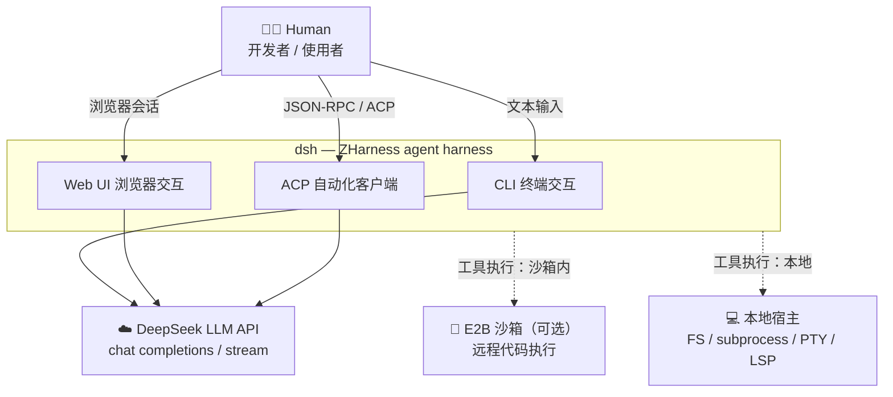
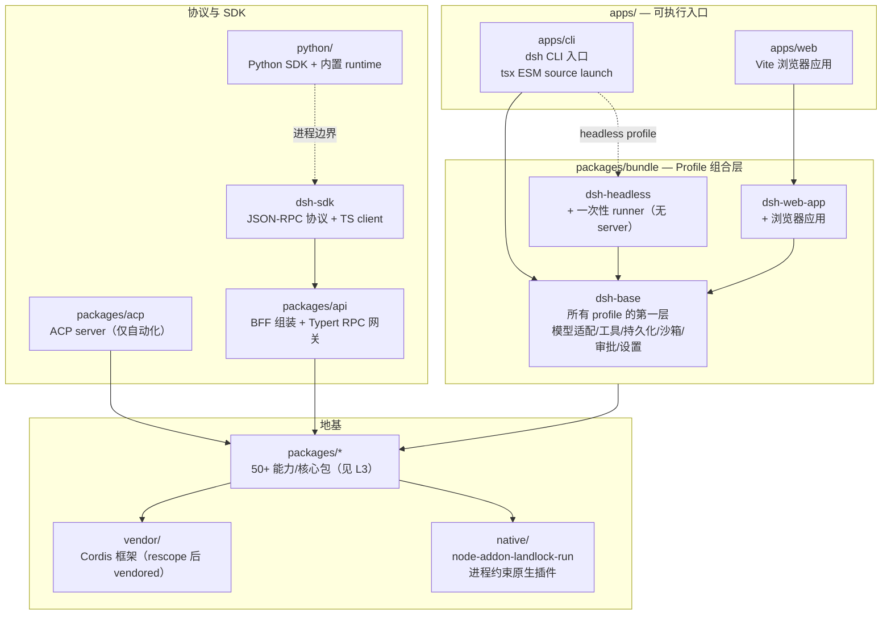
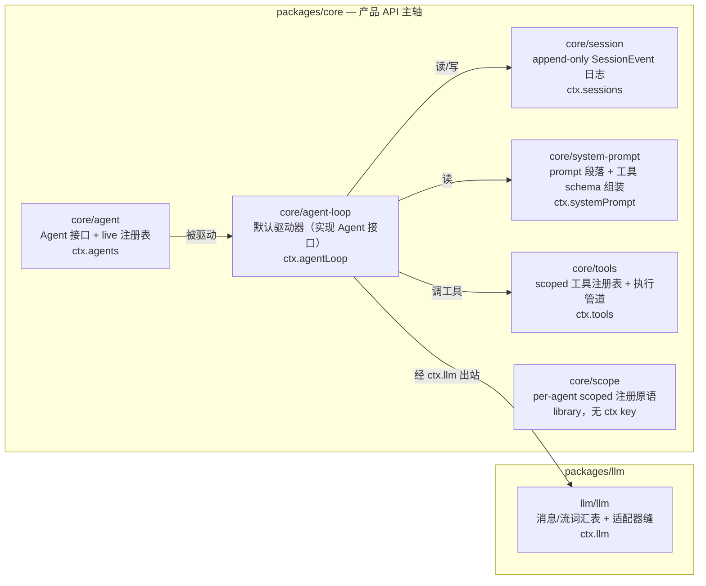
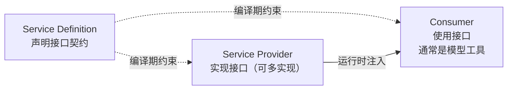
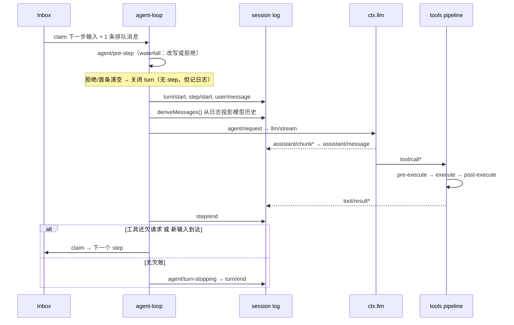
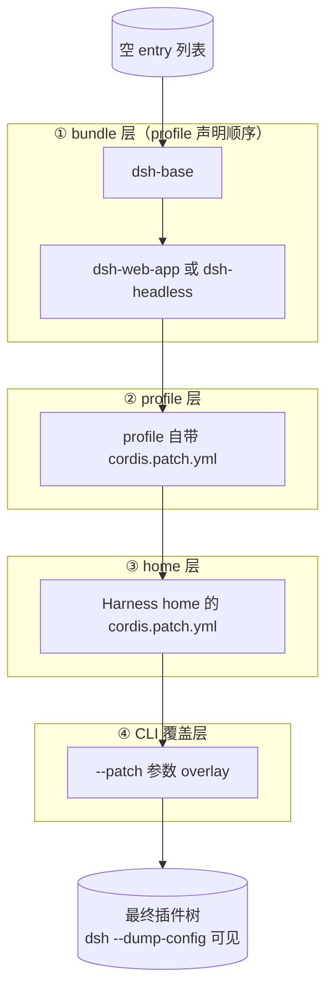

# ZHarness 架构全景（C4 视角）

> **数据源文件**：本 md 是唯一数据源，HTML 由 `gen_panorama_html.py` 从本文件生成，禁止手改 HTML。
> **同步策略**：随学习路线图（`learning_roadmap.json`）进度逐层展开。每节标注解锁节点与状态。
> 最后更新：2026-08-15（解锁至 1-2-1）

## 进度索引

| C4 层 | 章节 | 解锁节点 | 状态 |
|---|---|---|---|
| L1 | [系统上下文](#l1-系统上下文) | 1-2-1 | ✅ 已展开 |
| L2 | [容器](#l2-容器) | 1-2-1 | ✅ 已展开 |
| L3 | [组件：核心包](#l3-组件核心包) | 1-2-1 | ✅ 已展开 |
| L3 | [组件：能力缝 seam](#l3-组件能力缝-seam) | 1-4-2 | 🔒 待展开（已有骨架） |
| L3 | [组件：Turn/Step 事件流](#l3-组件turnstep-事件流) | 1-2-1 | ✅ 已展开 |
| L3 | [组件：Profile/Bundle 组合](#l3-组件profilebundle-组合) | 1-2-1 | ✅ 已展开 |
| L4 | [代码：关键接口](#l4-代码关键接口) | 1-3 / 1-4 | 🔒 待展开 |

---

## L1 系统上下文

ZHarness（`dsh`）是一个插件式 agent harness：一切皆插件，包括模型适配器、工具注册表、会话日志和 agent loop 本身。

**关键事实**（来源：architecture.md）：

- 无特权核心：扩展方式是「在别的插件旁边挂一个插件」，注册即 effect，卸载即回收
- Session log 是唯一真相：*Model-visible means logged*，模型请求内容必须可从日志重建（运行时断言强制）
- 换一个 provider = 换整个执行世界（fs/subprocess 共享一个执行世界，指向远程沙箱时 Bash/PTY/LSP 整体跟随）

---

## L2 容器

仓库物理结构 → 运行时容器。`packages/` 下 50+ 分组均为 `@deepseek-ai/dsh-*` workspace 包。

**关键事实**：

- Profile = 命名组合（存于 Harness home），列出 bundle 顺序 + 自带 `cordis.patch.yml`
- 层叠顺序：profile 列出的 bundle（按序）→ profile `cordis.patch.yml` → home 级 patch → `--patch` 覆盖层
- 查看实际启动树：`dsh --profile web --dump-config`，任何一行都可被上层 patch 替换
- `@deepseek-ai/cordis` 是所有 harness 包的 peerDependency；ESM only；`!!js`（非 `!js`）只允许出现在 plugin `config` 与 entry `disabled` 字段

---

## L3 组件：核心包

产品 API 主轴（`ctx` key 来自 architecture.md 核心包表）：

**三个事件域**（选对域是大多数改动的第一个决策）：

| 域 | 用途 | 例子 |
|---|---|---|
| Session 事件 | 事实必须**熬过重载**（durable） | `session/event` 广播 `user/message`、`tool/result` |
| Agent 事件 (`agent/*`) | 观察/拦截**在途**工作 | inbox、step、status、request、validation |
| Capability 事件 | 给缝挂策略/适配器，**不 import loop** | `fs/*`、`tools/*`、`telemetry/*` |

---

## L3 组件：能力缝 seam

> 🔒 按 1-4-2 精读能力包后展开细节。当前为骨架。

一个 seam = 三个角色，缺一不算：

已知 seam 一览（`ctx` key → 典型 provider / consumer）：

| seam key | provider 变体 | 消费者 |
|---|---|---|
| `ctx.llm` | DeepSeek 适配器 | agent-loop |
| `ctx.fs` | 本地 / 沙箱 FS | fs 工具、LSP |
| `ctx.subprocess` | 本地进程树 | shell、terminal |
| `ctx.shell` | 本地 / pwsh | Bash 工具 |
| `ctx.terminals` | 持久会话 | dsh-tool-terminal |
| `ctx.sandbox` | Landlock / E2B | 消费者在 spawn 前 wrap argv |
| `ctx.agents`（subagent） | 子 agent / 委派 turn | subagent 工具 |
| `ctx.commands` | 人发命令（无模型 turn） | CLI 命令分发 |
| `ctx.jobs` | 后台工作 | `job_*` 工具 |

---

## L3 组件：Turn/Step 事件流

step = 一次模型请求 + 它调用的工具；turn = 零或多个 step。输入只走一条 inbox。

**waterfall vs serial**：`agent/pre-step`、`agent/request`、`llm/stream`、三个 `tools/*` 是 waterfall（listener 必须调 `next()` 下放）；`agent/turn-stopping` 是 serial 且无 `next()`。durable 事件：`turn/*`、`step/*`、`user/message`、`assistant/*`、`tool/*`。

**注入语义**：`agent.inject()` 的 context 落在 inbox 排队，直到下一条唤醒型消息到来才被 claim。

---

## L3 组件：Profile/Bundle 组合

patch 按 row id 定位：整体替换该 row 的 config，或插入新 row。`dsh.profile` / `dsh.bundle` 字段在各自 `package.json` 里声明。

---

## L4 代码：关键接口

> 🔒 待 1-3（Cordis 心智模型）与 1-4（按包精读）解锁。届时补充：
> - `ctx.effect()` / `ctx.on()` 注册语义与 unwind
> - declaration merging 事件表（`SessionEventMap` / `AgentEvents`）
> - `Agent` 接口签名与 agent handle 取消语义
> - 典型能力包的三件套代码位置（以 fs 或 skill 为例）

---

## 新行为落点速查（摘自 architecture.md）

| 目标 | 机制 |
|---|---|
| 加模型 provider | 在 `ctx.llm` 上注册适配器 |
| 加模型可见能力 | 在 `ctx.tools` 注册，schema 自动进 prompt 组装 |
| 单会话不同能力集 | 组 agent preset；service row 需 `isolate` realm |
| 加 shell 执行 | 注册 `ctx.shell` backend；本地实现经 `ctx.subprocess` spawn |
| 拦截请求/工具/turn | 用对应 `agent/*` 或 `tools/*` 事件 |
| 注入模型可见上下文 | `agent.inject()`，落在下一个被接纳的请求 |
| 加 durable 会话状态 | 扩展 `SessionEventMap`，从日志渲染和重放 |
| fork 活会话 | `ctx.sessions.fork(source, boundary?, childSessionId?)` |
| 把注册限定到单 agent | 用该 agent 的 `agent.ctx` |
