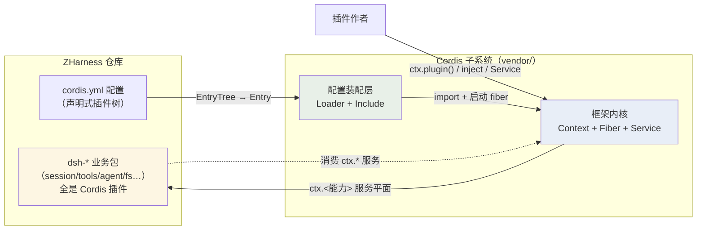
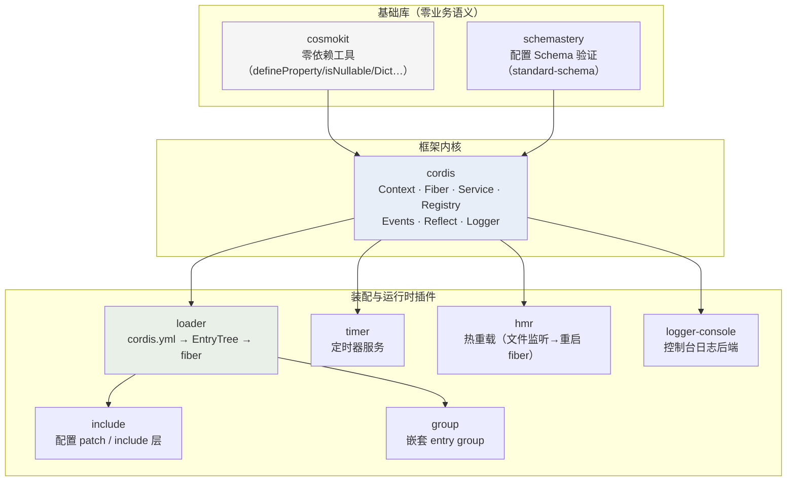
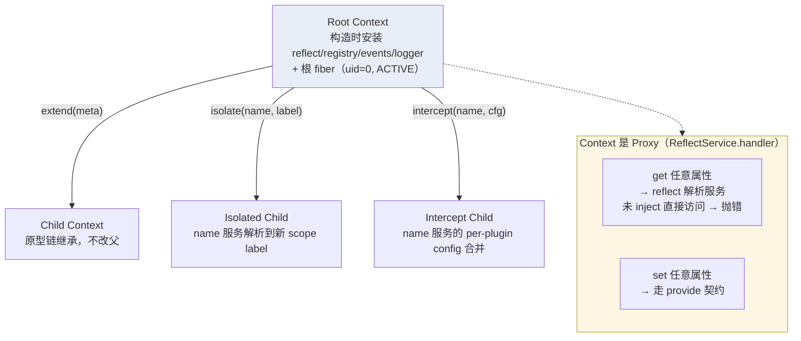
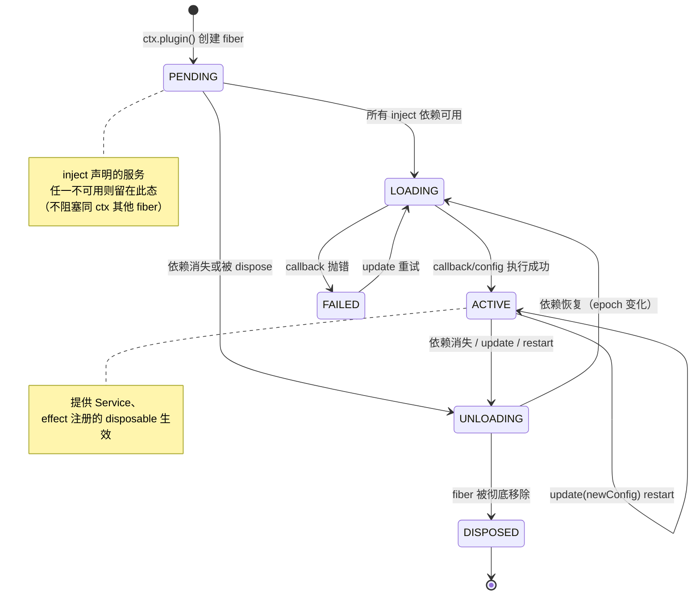
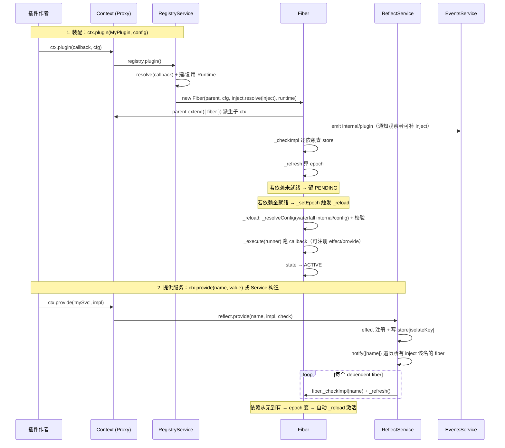
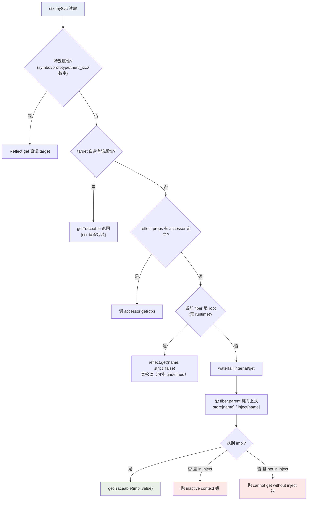
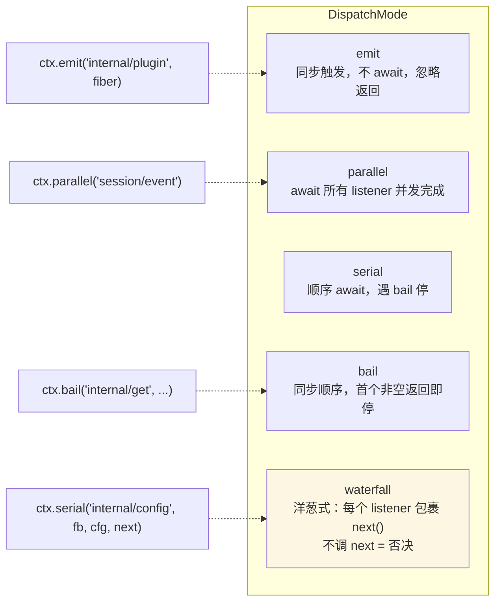
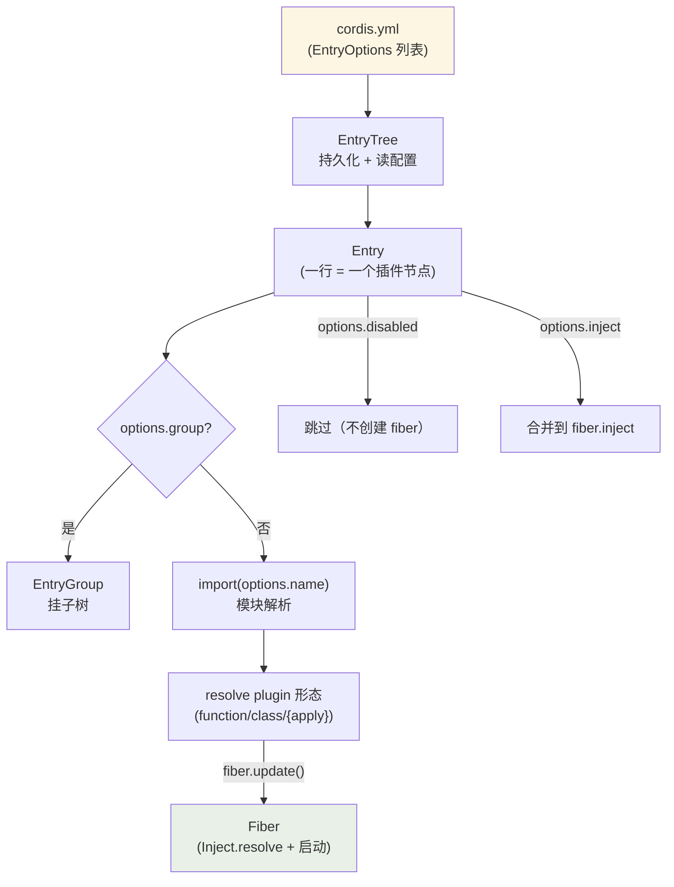
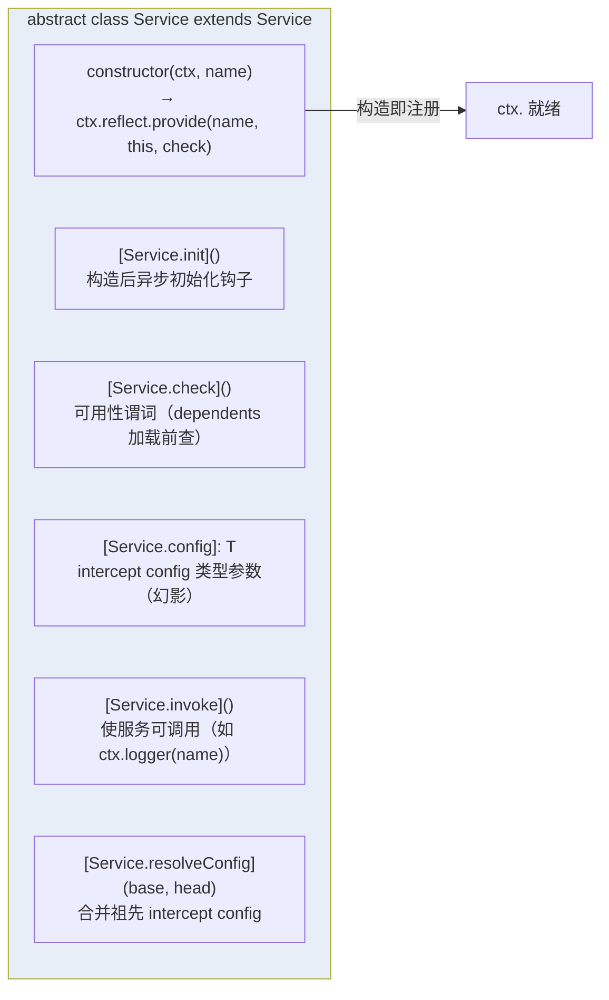
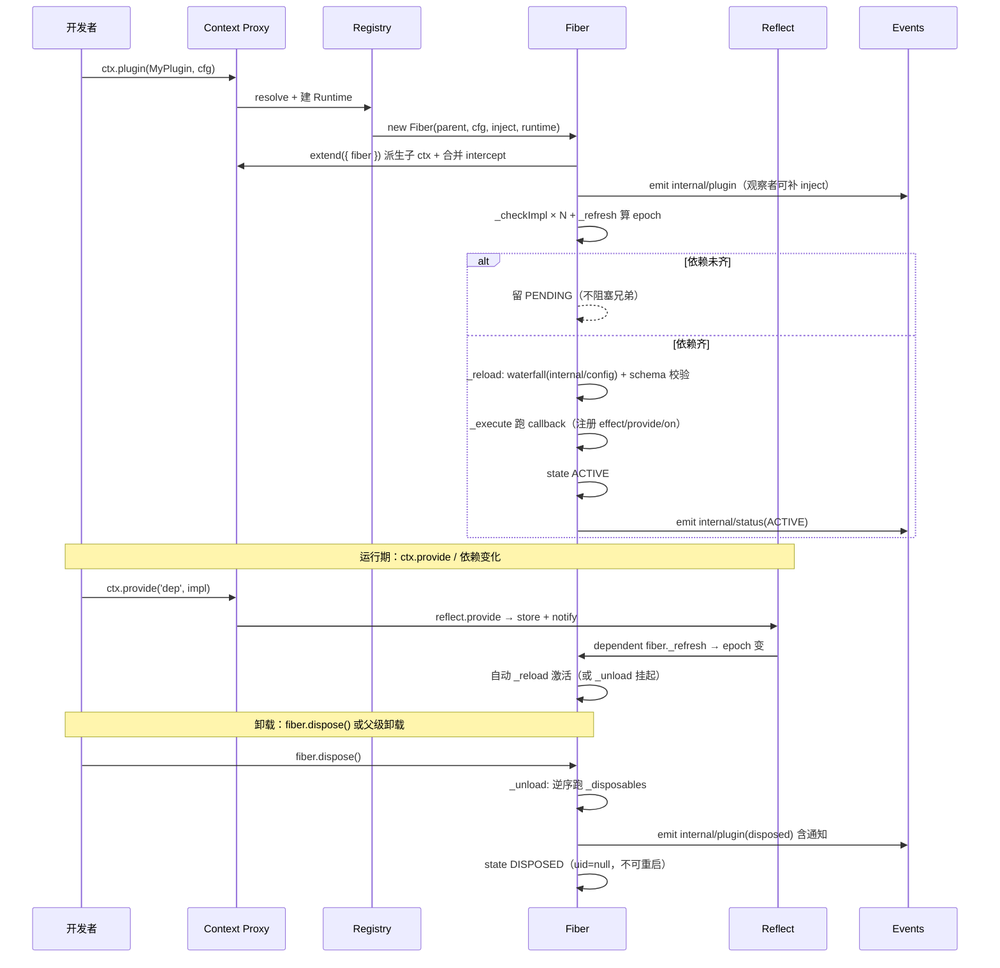

# Cordis 子系统（C4 视角）

> **数据源**：本文件基于 `vendor/cordis/src/*` 与 `vendor/{loader,include,group,timer,hmr,logger-console,cosmokit,schemastery}/src/*` 源码梳理，是 ZHarness 框架底座的独立 C4 文档。
> **定位**：与 `architecture_panorama.md`（ZHarness 应用层）互补——本文聚焦 vendored 的 `@deepseek-ai/cordis` 框架本身。
> 最后更新：2026-08-16

## 为什么单独讲 Cordis

ZHarness 的 AGENTS.md 第一句即「plugin-based agent harness on vendored Cordis: **everything is a plugin**」。Cordis 不是普通依赖，而是被 **source-vendored**（连源码一起搬进 `vendor/`、重 scope 为 `@deepseek-ai/*`、可审计可打补丁）的框架底座。ZHarness 的每个 `dsh-*` 包都是一个 Cordis 插件，所有能力（session/tools/agent/fs…）都以 `Service` 形式挂在 `ctx` 上。理解 Cordis = 理解 ZHarness 的运行时地基。

---

## L1 系统上下文——Cordis 在生态中的位置

Cordis 回答三个问题：**插件怎么写**（Plugin 三形态 + `apply(ctx, config)`）、**插件怎么装配与依赖**（`inject` 声明门控 + `Service` 注册）、**插件怎么活着与死去**（`Fiber` 生命周期 + `effect/disposable` 自动清理）。

---

## L2 容器——九个 vendored 包的分工

Cordis 子系统由 9 个 source-vendored 包组成（见 `vendor/README.md` 清单）。按职责分三层：

| 包 | 角色 | 关键导出 |
|---|---|---|
| `cordis` | 框架内核 | `Context` / `Fiber` / `Service` / `RegistryService` / `EventsService` / `ReflectService` |
| `cosmokit` | 零依赖工具 | `defineProperty` / `isNullable` / `Dict` / `deepEqual` |
| `schemastery` | 配置 schema | `Config`（standard-schema v1，驱动 fiber 启动前的 `resolveConfig` 校验） |
| `loader` | 配置装配 | `Loader`(=EntryTree) / `Entry` / `EntryGroup` / `EntryOptions` |
| `include` | 配置补丁层 | include + patch 叠加（`!!js` 表达式、`applyEntryPatches`） |
| `group` | 嵌套分组 | `EntryGroup`（一个 entry 下挂子树） |
| `timer` | 定时器 | `ctx.setTimeout/setInterval`（fiber 卸载自动清） |
| `hmr` | 热重载 | 文件变化 → `fiber.update()` 重启，不丢配置 |
| `logger-console` | 日志后端 | 控制台 transport，对接 `LoggerService` |

> **vendor 化的代价与收益**：源码全在仓内（可审计、可打补丁，见 `vendor/README.md` 的 18 条 local-modification log，含 fiber 生命周期硬化、loader 事务化配置协调等），但所有包 `private: true` 且重 scope，不污染上游 npm 名空间。

---

## L3 组件——内核六件套

### C1 上下文——Context 是一个 Proxy

**核心设计**：`Context` 构造函数 `return new Proxy(this, ReflectService.handler)`——此后任何 `ctx.xxx` 读取都被 proxy 拦截走服务解析。`extend/isolate/intercept` 都是 `Object.create(parent)` 派生子作用域，**父级永不变异**，这让插件可以在隔离 scope 下提供/消费同名服务而不互相污染。

- `isolate(name, label)`：给 `name` 服务换一个 scope label（Symbol）。同 label 的 isolate 共享 scope，不同 label 互不可见——这是「单会话不同能力集」「多实例」的底层机制。
- `intercept(name, config)`：给子作用域里 `name` 服务追加拦截配置，`Service[resolveConfig]` 沿原型链收集祖先 intercept 后合并（祖先优先级低，本层高）。

### C2 容器——Fiber 生命周期状态机

一个 `ctx.plugin()` 调用 = 创建一个 `Fiber`（插件运行实例）。Fiber 的状态机驱动整个加载/卸载/重载：

**关键不变量**（源码 `fiber.ts`）：
- **epoch 门控**：`_runner.epoch` 是一个字符串，由当前所有依赖 fiber 的 uid 拼成（`:`分隔）。任一依赖变化 → epoch 变 → 触发 unload/reload。`INACTIVE` 哨兵值表示「无依赖或依赖缺失」。
- **effect 即资源**：`ctx.effect(setup)` 立即执行 `setup`，收集其返回的 disposer（可单个/数组/生成器/async），fiber 卸载时**逆序**运行。effect 注册期间若 fiber 已 `UNLOADING` 直接抛 `INACTIVE_EFFECT`。
- **disposable 单次性**：公开 disposer 单次生效，但结构属主可 join 一个已开始的清理（`effectInertia` WeakMap）。
- **重新入安全**：fiber 构造期先在父级注册 disposer，再发 `internal/plugin` 通知；同步观察者若此时 dispose 它或父级，disposer 已就位能正确回滚。

### C3 组件——服务注册与依赖注入时序

这是 Cordis 的心脏：**声明 inject → 依赖门控 → provide 唤醒 → reload**。

**依赖注入的三条契约**（实证自源码）：
1. **inject 是声明式的**：`Plugin.Base.inject`（数组或 name→config 映射）声明所需服务。`Inject.resolve` 归一化为 map。fiber 启动前**逐个 `_checkImpl`**，任一缺失则停在 PENDING——这是 ZHarness 里 ToolRuntime `static inject=['systemPrompt']` 的硬依赖根源。
2. **provide 即注册**：`ctx.provide(name, value)` 经 `reflect.provide` 写入按 isolate label 索引的 `store`，并 `notify` 所有依赖该名的 fiber 重新评估 epoch。`Service` 子类构造时 `super(ctx, name)` 自动走此路径——这就是 ZHarness `FileSystem extends Service` 构造即注册为 `ctx.fs` 的机制。
3. **未 inject 的访问直接抛错**：proxy get 陷阱里，若属性不在自身、非 accessor、且 `prop in fiber.inject` 而当前非 ACTIVE，抛 `cannot get required service "X" in inactive context`。这逼消费者必须声明 inject——fail-fast，杜绝隐式依赖。

### C4 组件——服务解析链（Proxy get 的完整路径）

`ctx.mySvc` 这一次读取，proxy 内部走的解析链：

这条链解释了 ZHarness 里的一个高频现象：**在 `apply(ctx)` 体内直接 `ctx.fs` 会抛错**，必须 `inject=['fs']` 声明依赖后才能访问——因为 `apply` 跑在 fiber 的 LOADING 阶段，此时若未 inject，proxy 走到「not in inject」分支抛错。

### C5 组件——事件总线五种派发模式

`EventsService` 把方法 mixin 到 `ctx`（`on/once/emit/parallel/serial/bail/waterfall`）。五种 dispatch mode 对应不同语义：

Cordis 内部大量用 `waterfall` 做可拦截的扩展点：`internal/config`（配置解析前可改写）、`internal/update`（fiber 更新前可否决/替换）、`internal/get`/`internal/set`（服务读写可拦截）。ZHarness 的 HMR 就是挂 `internal/update` waterfall 来接管重启语义。

### C6 组件——Loader：cordis.yml 到 fiber 的装配

`Loader`（= `EntryTree`）把声明式配置树转成运行时 fiber。这是 ZHarness `cordis.yml` 的执行引擎：

`EntryOptions` 字段（源码 `config/entry.ts`）：`id`（树内稳定 id）、`name`（模块 specifier）、`config`、`group`、`disabled`、`inject`。Loader 的事务化更新（local-mod #8）：先 import 新 entry 再 dispose 旧的，apply 失败则回滚上一个 plugin/config——保证配置热更新不丢服务。`disabled` 是唯一支持 `!!js` 表达式插值的元字段（local-mod #18），可按运行时条件启停插件。

---

## L4 代码——关键接口契约速查

### 插件三形态

| 形态 | 签名 | 何时用 |
|---|---|---|
| Function | `function(ctx, config) { ... }` | 最轻量，一次性副作用 |
| Constructor | `class { constructor(ctx, config) {} }` | 需要实例状态、`@Inject` 装饰器、`[Service.init]` |
| Object | `{ apply(ctx, config) {} }` | 需要静态元数据（name/Config/inject/provide）一起导出 |

三者都可选带 `Base` 元数据：`name`、`Config`(standard-schema)、`inject`、`provide`、`intercept`。`RegistryService.resolve` 把三形态归一为一个 callback 作为 registry 身份键。

### 核心 API 契约

| API | 契约 | 后果 |
|---|---|---|
| `ctx.plugin(P, config)` | 校验 config → 建 fiber → 返回可 await 的 fiber | await 结算后抛启动错误 |
| `ctx.inject(deps, cb)` | `plugin({inject, apply:cb})` 的语法糖 | 依赖变就卸载重跑 cb |
| `ctx.provide(name, value)` | 注册服务，返回 disposer | fiber 卸载自动注销 + 唤醒依赖 |
| `ctx.get(name, strict?)` | 不需 inject 的宽松读；strict 只返回 ACTIVE 提供者 | strict=true 时未就绪返回 undefined |
| `ctx.set(name, value)` | 仅提供者 fiber 可改；改未提供者抛错 | —— |
| `ctx.effect(setup, label?)` | 立即跑 setup，收集 disposer，返回单次 disposer | fiber 卸载逆序清理；UNLOADING 态注册抛错 |
| `ctx.on(name, listener, opts?)` | 注册 listener，返回移除器 | fiber 卸载自动移除 |
| `ctx.waterfall(name, ...args, next)` | 洋葱派发；不调 next 即否决 | ZHarness HMR/配置扩展点的基础 |
| `ctx.isolate(name, label?)` | 派生子 ctx，name 服务换 scope | 同 label 共享，不同 label 隔离 |
| `ctx.intercept(name, config)` | 派生子 ctx，追加 name 服务的 per-plugin config | 祖先优先级低，本层高 |
| `fiber.update(config, noSave?)` | 走 internal/update waterfall 后 restart | 可被 listener 否决/替换 |
| `fiber.restart()` | dispose + 同 config 重载 | —— |
| `fiber.await()` | 等待当前生命周期事务结束 | 重抛启动错误 |

### Service 基类契约

ZHarness 约定：**每个能力 = 一个 `Service` 子类 + 一个 provider 包 + consumer 包**（见 panorama L6 三角色）。`super(ctx, 'fs')` 这一行就是 `ctx.fs` 的诞生点。

### Symbol 键一览（`utils.ts`）

| Symbol | 用途 |
|---|---|
| `cordis.isolate` | ctx 上的隔离 map（name→scope label） |
| `cordis.intercept` | ctx 上的拦截 config map |
| `cordis.effect` | disposer 上挂的 EffectMeta 诊断树 |
| `cordis.filter` | ctx 上的事件 listener 过滤器 |
| `cordis.shadow` | 可调用服务的影子原型 |
| `Service.init/check/config/invoke/extend/tracker/resolveConfig` | Service 生命周期与配置钩子 |

所有 symbol 用 `Symbol.for(...)` 全局注册，跨 realm / 多份 cordis 副本可识别（`Context.is` 也靠此跨副本判定）。

---

## 一图串起：一次 ctx.plugin() 的完整生命周期

---

## 与 ZHarness 的映射速查

| Cordis 概念 | ZHarness 里的体现 |
|---|---|
| `Service extends Service` | `FileSystem` / `ToolRuntime` / `SessionStore` 等能力基类 |
| `super(ctx, 'fs')` | 构造即注册 `ctx.fs` |
| `inject=['tools','fs']` | 每个 consumer 插件声明依赖（ToolRuntime 硬依赖 `systemPrompt`） |
| `ctx.effect()` | ZHarness 约定「registrations are effects」——每处注册走 effect/on，返回 disposer |
| `ctx.isolate()` | 单会话不同能力集 / service row isolate realm |
| `Loader` + `cordis.yml` | `dsh --profile` 的声明式插件树 |
| `fiber.update()` + HMR | 配置热更新不丢状态 |
| `waterfall internal/update` | ZHarness HMR 接管重启语义的挂载点 |
| `internal/plugin` 事件 | agent-loop 观察插件装配（panorama L5 tools 族） |

---

## 附：vendor 化的 18 条本地修改（摘要点）

Cordis 不是「拿来就用」——`vendor/README.md` 记录了 18 条与上游的分叉，几条关键的：

1. **fiber 生命周期硬化**（#6）：闭合三个重入 disposal 缺口——effect 的 owner-list wrapper 在 setup 体之前注册；async cleanup 保持 owner 可见直到静止；effect 创建在 `UNLOADING` 态被拒。
2. **loader 事务化配置协调**（#8）：先 import 新 entry 再 dispose 旧的，apply 失败回滚上一 plugin/config；group 更新并发启动候选、await 全部结果、失败回滚。
3. **include 串行化子树变更**（#12）：每个 include 的子树变更走单队列，避免 group 事务 `update` 不可重入导致 create/rollback 交错。
4. **lazy config 解析**（#15）：保留 raw fiber config，声明 inject 激活后才经 `internal/config` 解析；provider 替换重新解析 raw 表达式。
5. **JSDoc enrichment**（#7）：公共插件作者面补全 `@param/@returns` 与契约文档（网站 API 生成器对未文档成员硬报错）。

> 完整清单见 `vendor/README.md#local-modifications`。这些修改是 ZHarness 能在生产环境稳定跑 Cordis 的关键，也是「source-vendored 而非 npm 依赖」的核心理由。
